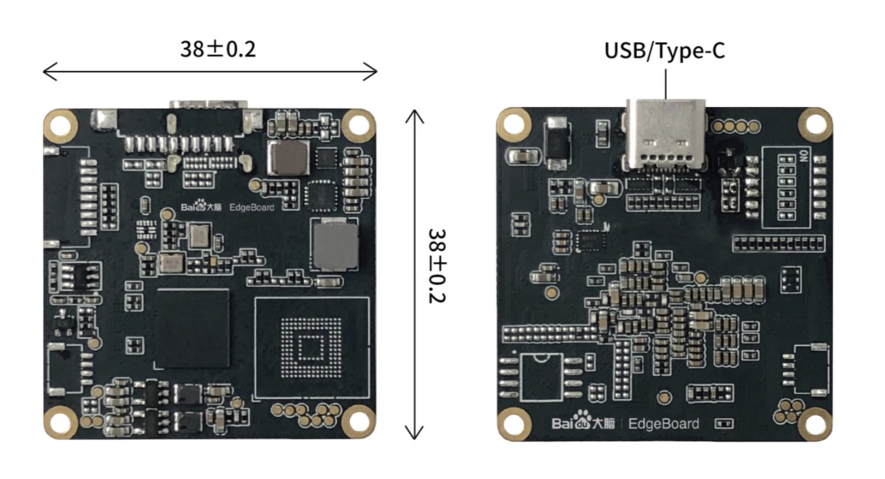
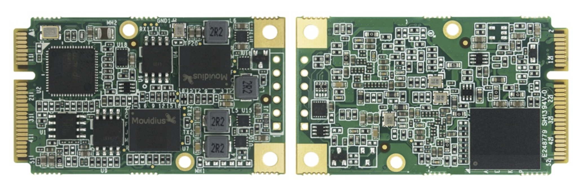

# Hydra VMX

Baidu Research Institute Hydra VMX prototype uses Intel® Movidus™ MyriadX chip with 2 NCE neural network accelerators and 16 programmable 128bit processors for 1TOPS neural network inference ability, supports USB3 communication through the Type-C as well as standard mPCIe interfaces.

Its open peripheral circuit can be embedded in the third-party intelligent products with simple docking, fast development speed, and powerful deep learning calculation functions.

Besides PaddleX ecological compatibility with other PaddlePaddle related AI ecosystem, BRI Hydra VMX prototype is also deeply integrated with the EasyDL platform for widely adaptation. Different algorithms can be transplanted through the OpenVINO™/OpenCV software packages, at the same time, it is also compatible with Linux, Android and Windows environments for a wider range of applications, more stable performance, enhanced user experience, and is suitable for edge computing application scenarios such as smart city & smart industry, medical treatment, head detection, gesture and posture recognition, object detection and classification, safety inspection, industrial quality inspection, medical screening, algorithm transplantation and other non-standardized scene, for example the [EdgeBoard-VMX](https://aim.baidu.com/product/3e1f397f-77ec-4f7f-846b-25e39d694f4f) from [EdgeBoard](https://ai.baidu.com/tech/hardware/deepkit) production line.

BRI Hydra VMX prototype is suitable for deep learning acceleration and can solve complex artificial intelligence software and hardware design challenges. It can integrate vision-based accelerators and inference engines to implement low-cost and low power consumption edge computing solutions, such as integrating 2D/3D face detection & recognition, face attribute analysis, OCR, retail and other standardized scene, for example [Xunxiang](https://ai.baidu.com/tech/hardware/xunxiang) [Xeye](https://www.linkedin.com/posts/haofeng-kou-4836761_introducing-the-embedded-ai-computing-module-activity-6454918653489016832-cHCO) & [Dumu](https://ai.baidu.com/tech/dumu) products.

In addition to above rich software resource including open source ecosystem, the BRI Hydra VMX also adopts an [Open Edge Design](platform/vmx-usb-schematic.pdf) with the mission to apply the benefits of open source and open collaboration to software & hardware co-design and rapidly increase the pace of innovation in, near and around edge computing production and research.

## PaddlePaddle

## EasyDL

EasyDL is a simple and easy-to-use model service platform based on Baidu PaddlePaddle ecosystem. After model is trained from EasyDL, the downloaded software development kit can be quickly deployed to run in a few simple steps on VMX production prototype. BRI Hydra VMX accelerator card contains an independent AI computing chip, adopts USB Type-C with the standard communication protocol, simple and reliable, which can be connected to different core architectures, including X86, lane, ARM SOC, etc for EasyDL deployment with PaddlePaddle.

## Android

BRI Hydra VMX prototype not only supports the integrated development of different versions of Android, but also expands the existing Baidu AI resource to the Android ecosystem through open source community to open up a potential broader market.

## OpenVINO

OpenVINO™ is a free toolkit facilitating the optimization of a deep learning model from a framework and deployment using an inference engine and it is, cross-platform and free for use under Apache License, supported by open source and Intel ecosystem communities, which is fully compatible with BRI Hydra VMX prototype design.