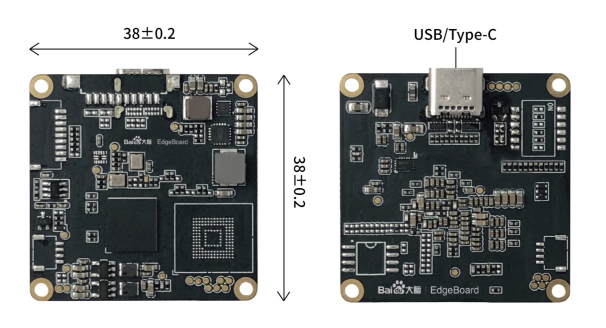

# EdgeBoard-VMX

百度大脑 [EdgeBoard-VMX](https://aim.baidu.com/product/3e1f397f-77ec-4f7f-846b-25e39d694f4f) 加速卡采用 Intel® Movidus™ 视觉 MyriadX 芯片 1TOPS 神经网络推理能力，自带 2 个 NCE 神经网络加速处理器，16 个可编程 128bit 处理器。采用标准 USB3 通讯协议通过 Type-C 接口方式，配合外围电路即可将该模组嵌入到第三方智能化产品中，对接简单，开发速度快，具有强大的深度学习计算功能。

支持百度 PaddlePaddle 生态兼容 PaddleX 和 Paddle2onnx/PaddleHub 等软件包与 EasyDL 平台深度结合并可以广泛适配，可通过 OpenVINO™/OpenCV 软件库工具链移植算法。同时兼容 Linux，Android 和 Windows 环境，使产品应用范围更广，性能更稳定，增强用户体验并适用于安防、工业、医疗、零售等边缘计算应用场景。除了软件的多样性，硬件也采用了开放式设计。

[EdgeBoard-VMX](https://aim.baidu.com/product/3e1f397f-77ec-4f7f-846b-25e39d694f4f) 加速卡适用于深度学习加速，能够解决复杂的人工智能软硬件设计挑战，它可以集成基于视觉的加速器和推理引擎来实现深度边缘学习的解决方案，比如集成 2D/3D 人脸识别特征比对、人头检测、人脸属性分析（性别、年龄）、手势及姿态识别、物体检测及分类、安全排查、工业质检、医疗筛查、零售分类、算法移植等功能。

## 飞桨生态 Paddle

## 百度大脑 EasyDL

EasyDL 是基于百度自主研发的深度学习平台飞桨结合业界先进的工程服务技术打造的简单易用的模型训练和服务平台。开发者从 EasyDL 训练模型之后，下载的软件部署包中包含了 EdgeBoard-VMX 简单易用的 SDK 和 Demo，只需简单的几个步骤，即可快速部署运行。

百度大脑 EdgeBoard-VMX 加速卡包含独立的 AI 运算芯片，采用 USB Type-C 通讯方式，通讯协议简单可靠，可连接不同芯片架构主机，包括 X86、单片机、ARM SOC 等。加速卡运行需要通过 Type-C 接口连接宿主机执行，宿主机目前支持的软硬件环境包括：
- Linux: x86-64, aarch64, armv7hf
- Windows: x86-64, Windows 10

## Android

百度大脑 EdgeBoard-VMX 加速卡支持不同版本 Android 的集成开发，不但扩展了现有软件的支持环境，而且通过对接 Android 生态，引入百度 AI 软硬结合解决方案，推进开源社区，开辟更大的潜在市场。

## OpenVINO

OpenVINO™ 工具套件是用于快速开发应用程序和解决方案，以解决各种任务（包括人类视觉模拟、自动语音识别、自然语言处理和推荐系统等）的开源综合工具套件，完全兼容 EdgeBoard-VMX。该工具套件基于最新一代的人工神经网络，包括卷积神经网络 (CNN)、递归网络和基于注意力的网络，可扩展 EdgeBoard-VMX 的计算机视觉和非视觉工作负载，从而最大限度地提高性能，同时通过从边缘到云部署的高性能、人工智能和深度学习推理来为应用程序加速。
