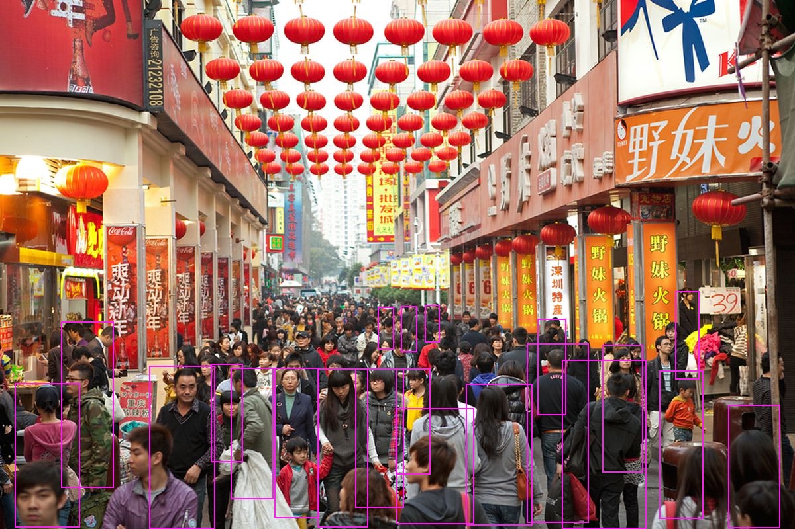

# Android

## System Setup
Host: VXP x86 Ubuntu 16.04/18.04 LTS	

Target: RK3399-Firefly w/ Android 7.1	

```
Android Version API level & NDK release
Android10	10  	API level 29
Pie 		9   	API level 28
Oreo		8.1.0	API level 27
Oreo		8.0.0	API level 26
Nougat		7.1  	API level 25
Nougat		7.0 	API level 24
```

Directory Tree:
```
$ tree -L 1
.
├── android-ndk
├── android-ndk-r20-linux-x86_64.zip
├── cmake-3.11.4
├── cmake-3.11.4.tar.gz
├── cmake-3.15.1
├── cmake-3.15.1.tar.gz
├── data
├── models
├── OpenBLAS
├── opencv
├── openvino
├── platform-tools
└── platform-tools_r30.0.3-linux.zip
9 directories, 4 files
```

General Dependencies Setup (optional):
- Ubuntu 16 LTS
```
sudo apt-get install --assume-yes build-essential git
sudo apt-get install --assume-yes pkg-config unzip ffmpeg qtbase5-dev python-dev python3-dev python-numpy python3-numpy
sudo apt-get install --assume-yes libopencv-dev libgtk-3-dev libdc1394-22 libdc1394-22-dev libjpeg-dev libpng12-dev libtiff5-dev libjasper-dev
sudo apt-get install --assume-yes libavcodec-dev libavformat-dev libswscale-dev libxine2-dev libgstreamer0.10-dev libgstreamer-plugins-base0.10-dev
sudo apt-get install --assume-yes libv4l-dev libtbb-dev libfaac-dev libmp3lame-dev libopencore-amrnb-dev libopencore-amrwb-dev libtheora-dev
sudo apt-get install --assume-yes libvorbis-dev libxvidcore-dev v4l-utils vtk6
sudo apt-get install --assume-yes libatlas-base-dev libblas-dev liblapacke-dev libopenblas-dev libgdal-dev checkinstall
```
- Ubuntu 18 LTS
```
sudo apt install build-essential cmake git pkg-config libgtk-3-dev \
	libavcodec-dev libavformat-dev libswscale-dev libv4l-dev \
	libxvidcore-dev libx264-dev libjpeg-dev libpng-dev libtiff-dev \
	gfortran openexr libatlas-base-dev python3-dev python3-numpy \
	libtbb2 libtbb-dev libdc1394-22-dev
```

Upgrade CMAKE:
```
// Download & install at least version 3.6 from https://cmake.org/files we tried 3.11.4 & 3.15.1
sudo apt-get remove cmake   // if the old version doesn't match requirement
./bootstrap
make -j2
sudo make install
```

Install OpenBLAS:
```
git clone https://github.com/xianyi/OpenBLAS
cd OpenBLAS
// RK3399 Dual Cortex-A72 for high-performance, Quad Cortex-A53 for low power
make \
    TARGET=CORTEXA72 \
    ONLY_CBLAS=1 \
    CC=$ANDROID_TOOLCHAIN/bin/aarch64-linux-android24-clang \
    AR=$ANDROID_TOOLCHAIN/bin/aarch64-linux-android-ar \
    HOSTCC=gcc \
    -j4
make PREFIX=~/projects/android/OpenBLAS/install install
```


## Android Setup
NDK Setup:
```
cd ~/projects/android
// Download latest Android NDK or R20(default) as below
wget https://dl.google.com/android/repository/android-ndk-r20-linux-x86_64.zip
unzip android-ndk-r20-linux-x86_64.zip 
mv android-ndk-r20 android-ndk
```

Platform Tools:
```
// Download latest platform-tools or r30.0.3(default) from Android
https://developer.android.com/studio/releases/platform-tools#downloads
// Setup to:
~/projects/android/platform-tools

// Modify ~/.bashrc to the corrected path:
export ANDROID_NDK_HOME="~/projects/android/android-ndk"
export ANDROID_PLATFORM_TOOLS="~/projects/android/platform-tools"
export ANDROID_TOOLCHAIN="$ANDROID_NDK_HOME/toolchains/llvm/prebuilt/linux-x86_64"
export PATH="$PATH:$ANDROID_NDK_HOME:$ANDROID_PLATFORM_TOOLS:ANDROID_TOOLCHAIN"
export LD_LIBRARY_PATH="/usr/lib:/usr/local/lib:$LD_LIBRARY_PATH"
```


## OpenCV Setup:
```
git clone https://github.com/opencv/opencv.git
cd opencv
git checkout -b 4.3.0-openvino-2020.3.0 4.3.0-openvino-2020.3.0
mkdir -p build; cd build; mkdir -p out

cmake \
	-DCMAKE_TOOLCHAIN_FILE=~/projects/android/android-ndk/build/cmake/android.toolchain.cmake \
	-DANDROID_NDK=~/projects/android/android-ndk \
	-DANDROID_PLATFORM=android-24 \
	-DANDROID_STL=c++_shared \
	-DBUILD_JAVA=OFF \
	-DBUILD_ANDROID_EXAMPLES=OFF \
	-DBUILD_ANDROID_PROJECTS=OFF \
	-DBUILD_SHARED_LIBS=ON \
	-DCMAKE_INSTALL_PREFIX=~/projects/android/opencv/build/out \
	-DANDROID_ABI=arm64-v8a \
	-DBUILD_opencv_dnn=OFF \
	-DBUILD_opencv_videoio=ON \
	-DBUILD_opencv_video=OFF \
	-DBUILD_opencv_xfeatures2d=OFF -DBUILD_opencv_gapi=OFF ..
make -j4
make install
```


## OpenVINO Setup
Modification Patch:
```
git clone https://github.com/openvinotoolkit/openvino
cd openvino
git checkout -b 2020.3.0 2020.3.0
git submodule update --init --recursive

diff --git a/CMakeLists.txt b/CMakeLists.txt index 902d3289..aa04e8fe 100644
--- a/CMakeLists.txt
+++ b/CMakeLists.txt
@@ -93,6 +93,7 @@ function(build_ngraph) endif()
if(ANDROID)
set(CMAKE_CXX_FLAGS "${CMAKE_CXX_FLAGS} -Wno-error=defaulted-
function-deleted -Wno-error=unused-command-line-argument")
+        LINK_LIBRARIES(c++_shared log mediandk)
         endif()
```

Build OpenVINO:
```
mkdir build; cd build
cmake   \
	-DCMAKE_BUILD_TYPE=Release \
	-DCMAKE_TOOLCHAIN_FILE=~/projects/android/android-ndk/build/cmake/android.toolchain.cmake \
	-DANDROID_ABI=arm64-v8a \
	-DANDROID_PLATFORM=android-24 \
	-DENABLE_SSE42=OFF \
	-DTHREADING=SEQ \
	-DENABLE_GNA=OFF \
	-DENABLE_PROFILING_ITT=OFF \
	-DENABLE_TESTS=OFF \
	-DENABLE_MKL_DNN=OFF\
	-DANDROID=ON\
	-DANDROID_STL=c++_shared \
	-DOpenCV_DIR=~/projects/android/opencv/build/out/sdk/native/jni \
	-DENABLE_OPENCV=ON \
	-DBLAS_LIBRARIES=~/projects/android/OpenBLAS/install/lib/libopenblas.so \
	-DBLAS_INCLUDE_DIRS=~/projects/android/OpenBLAS/install/include ..
make -j4
```


## Deployment
Download Models:
```
mkdir ~/projects/android/models
cd ~/projects/android/models
wget https://download.01.org/opencv/2020/openvinotoolkit/2020.3/open_model_zoo/models_bin/1/person-detection-retail-0013/FP16/person-detection-retail-0013.bin
wget https://download.01.org/opencv/2020/openvinotoolkit/2020.3/open_model_zoo/models_bin/1/person-detection-retail-0013/FP16/person-detection-retail-0013.xml
```

Setup Target:
```
// Change permissions
adb shell
su
chmod 777 -R /data/local
// push openvino
adb push ~/projects/android/openvino/bin/aarch64/ /data/local/
// push opencv
adb push ~/projects/android/opencv/build/out/sdk/native/libs/arm64-v8a/* /data/local/aarch64/Release/lib/
// push libusb
adb push ~/projects/android/openvino/inference-engine/temp/vpu/libusb/libs/arm64-v8a/libusb1.0.so /data/local/aarch64/Release/lib/
adb push ~/projects/android/openvino/inference-engine/temp/vpu/libusb/libs/arm64-v8a/* /data/local/aarch64/Release/lib/
// push libc++_shared.so
adb push ~/projects/android/android-ndk/sources/cxx-stl/llvm-libc++/libs/arm64-v8a/libc++_shared.so /data/local/aarch64/Release/lib/
adb push ~/projects/android/android-ndk/sources/cxx-stl/llvm-libc++/libs/arm64-v8a/* /data/local/aarch64/Release/lib/
// push models & data
adb push ~/projects/android/models/person-detection-retail-0013.* /data/local/aarch64/
adb push ~/projects/android/data/shopping-*.jpg /data/local/aarch64/
```

Android Execution:
```
adb shell
su
cd /data/local/aarch64/Release
export LD_LIBRARY_PATH=/data/local/aarch64/Release/lib/
./object_detection_sample_ssd -i ../friends.png  -m ../person-detection-retail-0013.xml -d MYRIAD
./object_detection_sample_ssd -i ../crowd.jpg  -m ../person-detection-retail-0013.xml -d MYRIAD
adb pull /data/local/aarch64/Release/out_0.bmp out_0.bmp
eog out_0.bmp
```

Results Examples:	

 	

 
