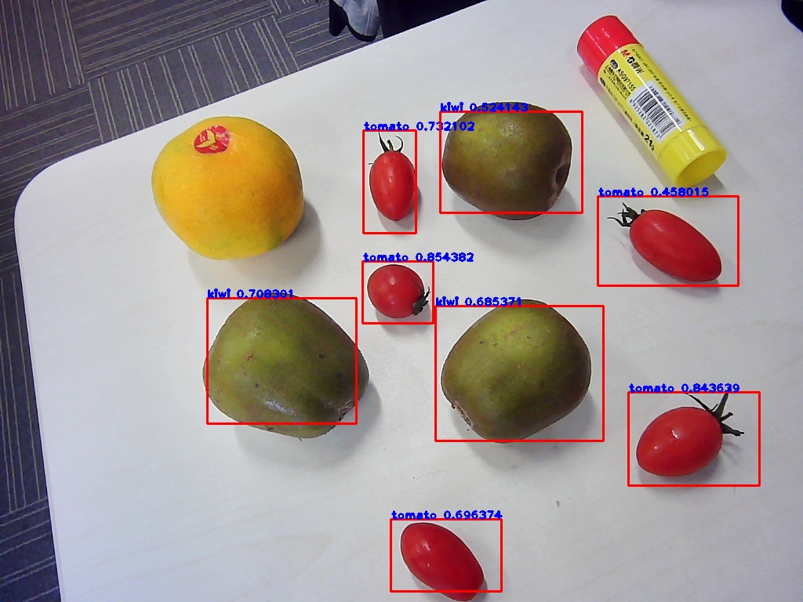

# EasyDL

## System
Host: VXP x86 Ubuntu 16.04/18.04 LTS	

Device: EdgeBoard-VMX w/ certified USB3.0 cables
```
$ sudo lsusb -v | grep -C 5 Myriad
  bMaxPacketSize0        64
  idVendor           0x03e7
  idProduct          0x2485
  bcdDevice            0.01
  iManufacturer           1 Movidius Ltd.
  iProduct                2 Movidius MyriadX
  iSerial                 3 03e72485
  bNumConfigurations      1
  Configuration Descriptor:
    bLength                 9
    bDescriptorType         2
```


## Dependency
- Install OpenVINO:
	```
	https://docs.openvinotoolkit.org/latest/openvino_docs_install_guides_installing_openvino_linux.html
	source /opt/intel/openvino/bin/setupvars.sh
	```
- EasyDL SDK
	```
	从 AI 市场订单详情或者 EasyDL 控制台获取序列号
	```


## Linux SDK
- Python SDK
	```
	https://cloud.baidu.com/doc/EASYDL/s/Bk7q4e4u5#python-sdk
	```
- C++ SDK
	```
	https://cloud.baidu.com/doc/EASYDL/s/Bk7q4e4u5#c-sdk
	```


## Linux Usage
- 使用流程：https://cloud.baidu.com/doc/EASYDL/s/Bk7q4e4u5#%E4%BD%BF%E7%94%A8%E6%B5%81%E7%A8%8B-1
- 运行参数配置：https://cloud.baidu.com/doc/EASYDL/s/Bk7q4e4u5#%E8%BF%90%E8%A1%8C%E5%8F%82%E6%95%B0%E9%85%8D%E7%BD%AE
- 初始化：https://cloud.baidu.com/doc/EASYDL/s/Bk7q4e4u5#%E5%88%9D%E5%A7%8B%E5%8C%96
- 预测图像：https://cloud.baidu.com/doc/EASYDL/s/Bk7q4e4u5#%E9%A2%84%E6%B5%8B%E5%9B%BE%E5%83%8F
- 预测视频：https://cloud.baidu.com/doc/EASYDL/s/Bk7q4e4u5#%E9%A2%84%E6%B5%8B%E8%A7%86%E9%A2%91
- 设置序列号：https://cloud.baidu.com/doc/EASYDL/s/Bk7q4e4u5#%E8%AE%BE%E7%BD%AE%E5%BA%8F%E5%88%97%E5%8F%B7
- 日志配置：https://cloud.baidu.com/doc/EASYDL/s/Bk7q4e4u5#%E6%97%A5%E5%BF%97%E9%85%8D%E7%BD%AE
- HTTP服务：https://cloud.baidu.com/doc/EASYDL/s/Bk7q4e4u5#http%E6%9C%8D%E5%8A%A1
- 其他配置：https://cloud.baidu.com/doc/EASYDL/s/Bk7q4e4u5#%E5%85%B6%E4%BB%96%E9%85%8D%E7%BD%AE


## Result	

 


## Windows Setup
- 安装依赖：https://cloud.baidu.com/doc/EASYDL/s/Bk7q4e4u5#1-%E5%AE%89%E8%A3%85%E4%BE%9D%E8%B5%96
- 离线SDK：https://cloud.baidu.com/doc/EASYDL/s/Bk7q4e4u5#2-%E8%BF%90%E8%A1%8C%E7%A6%BB%E7%BA%BFsdk
- 接口调用说明：https://cloud.baidu.com/doc/EASYDL/s/Bk7q4e4u5#%E6%8E%A5%E5%8F%A3%E8%B0%83%E7%94%A8%E8%AF%B4%E6%98%8E


## FAQ
- Linux FAQ: https://cloud.baidu.com/doc/EASYDL/s/Bk7q4e4u5#linux-faq
- Windows FAQ: https://cloud.baidu.com/doc/EASYDL/s/Bk7q4e4u5#windows-faq

