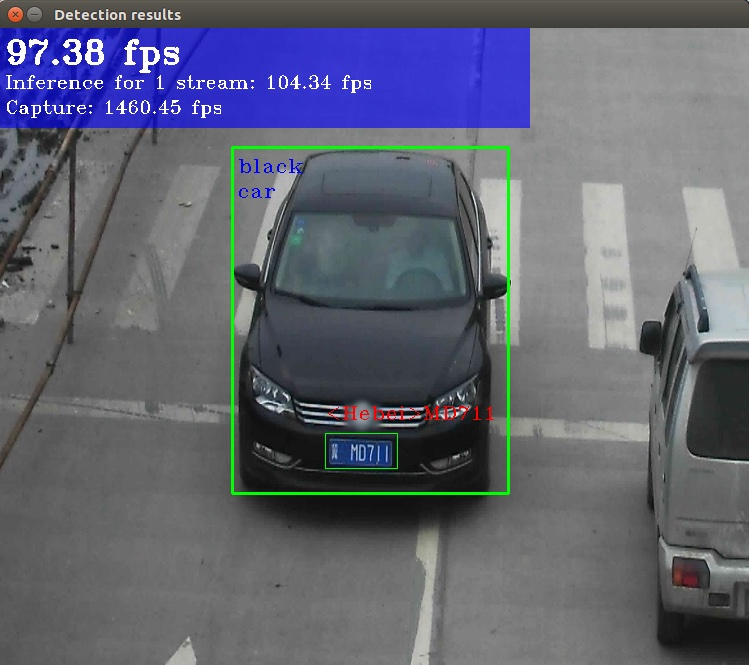

# OpenVINO

## Overview
OpenVINO™ toolkit is a comprehensive toolkit for quickly developing applications and solutions that solve a variety of tasks including emulation of human vision, automatic speech recognition, natural language processing, recommendation systems, and many others. Based on latest generations of artificial neural networks, including Convolutional Neural Networks (CNNs), recurrent and attention-based networks, the toolkit extends computer vision and non-vision workloads across different hardware including EdgeBoard-VMX, maximizing performance.

OpenVINO can be installed on Linux, Windows, MacOS, RaspberryPI and so on, we will use Linux as the example here.


## Installation
Take either of the following to install the OpenVINO:
- [Install Intel® Distribution of OpenVINO™ toolkit for Linux](https://docs.openvinotoolkit.org/latest/openvino_docs_install_guides_installing_openvino_linux.html)
- [Version 2021.4](https://docs.openvinotoolkit.org/2021.4/openvino_docs_install_guides_installing_openvino_linux.html) - default

Unpack:
```
tar -xvzf l_openvino_toolkit_p_<version>.tgz
cd l_openvino_toolkit_p_<version>
```

Install
```
sudo ./install_GUI.sh		// GUI
sudo ./install.sh   		// Command Line
```

Please strictly follow to finish the installation procedure (package 2021.4 is provided as reference).
- Introduction
- Requirements
- Overview
- Install OpenVINO™ Toolkit Core Components
- Install External Software Dependencies
- Set the Environment Variables
- Configure the Model Optimizer


## Setup
Add current Linux user to the users group:
```
sudo usermod -a -G users "$(whoami)"
```

Instal the USB rules:
```
sudo cp /opt/intel/openvino_2021/inference_engine/external/97-myriad-usbboot.rules /etc/udev/rules.d/
sudo udevadm control --reload-rules
sudo udevadm trigger
sudo ldconfig
```


## Scripts Sample
Image Classification:
```
cd ${INTEL_OPENVINO_DIR}/deployment_tools/demo
eog car.png

./demo_squeezenet_download_convert_run.sh -d MYRIAD

Top 10 results:
Image /home/user/dldt/inference-engine/samples/sample_data/car.png
classid probability label
------- ----------- -----
817     0.8363345   sports car, sport car
511     0.0946488   convertible
479     0.0419131   car wheel
751     0.0091071   racer, race car, racing car
436     0.0068161   beach wagon, station wagon, wagon, estate car, beach waggon, station waggon, waggon
656     0.0037564   minivan
586     0.0025741   half track
717     0.0016069   pickup, pickup truck
864     0.0012027   tow truck, tow car, wrecker
581     0.0005882   grille, radiator grille
total inference time: 2.6642941
Average running time of one iteration: 2.6642941 ms
Throughput: 375.3339402 FPS
[ INFO ] Execution successful
```

Inference Pipeline:
```
./demo_security_barrier_camera.sh -d MYRIAD
```
  

Benchmark:
```
./demo_benchmark_app.sh -d MYRIAD
```


## Code Application
Download Models:
```
There are public and pre-trained models from:
- [Open Model Zoo](https://github.com/openvinotoolkit/open_model_zoo)
- [Model Downloader](https://docs.openvinotoolkit.org/2021.4/omz_tools_downloader.html)
- Self-trained models

cd /opt/intel/openvino_2021/deployment_tools/tools/model_downloader/
python3 info_dumper.py --print_all
python3 info_dumper.py --print_all | grep <model_name>
sudo python3 ./downloader.py --name <model_name> --output_dir <models_dir>

sudo python3 ./downloader.py --name squeezenet1.1 --output_dir ~/models
	###############|| Downloading models ||###############
	========= Downloading /home/username/models/public/squeezenet1.1/squeezenet1.1.prototxt
	========= Downloading /home/username/models/public/squeezenet1.1/squeezenet1.1.caffemodel
	... 100%, 4834 KB, 3157 KB/s, 1 seconds passed
	###############|| Post processing ||###############
	========= Replacing text in /home/username/models/public/squeezenet1.1/squeezenet1.1.prototxt =========

./downloader.py --name vehicle-license-plate-detection-barrier-0106,vehicle-attributes-recognition-barrier-0039,license-plate-recognition-barrier-0001 --output_dir ~/models --precisions FP16
	################|| Downloading models ||################
	========== Downloading /home/username/models/intel/vehicle-license-plate-detection-barrier-0106/FP16/vehicle-license-plate-detection-barrier-0106.xml
	... 100%, 204 KB, 183949 KB/s, 0 seconds passed
	========== Downloading /home/username/models/intel/vehicle-license-plate-detection-barrier-0106/FP16/vehicle-license-plate-detection-barrier-0106.bin
	... 100%, 1256 KB, 3948 KB/s, 0 seconds passed
	========== Downloading /home/username/models/intel/vehicle-attributes-recognition-barrier-0039/FP16/vehicle-attributes-recognition-barrier-0039.xml
	... 100%, 32 KB, 133398 KB/s, 0 seconds passed
	========== Downloading /home/username/models/intel/vehicle-attributes-recognition-barrier-0039/FP16/vehicle-attributes-recognition-barrier-0039.bin
	... 100%, 1222 KB, 3167 KB/s, 0 seconds passed
	========== Downloading /home/username/models/intel/license-plate-recognition-barrier-0001/FP16/license-plate-recognition-barrier-0001.xml
	... 100%, 47 KB, 85357 KB/s, 0 seconds passed
	========== Downloading /home/username/models/intel/license-plate-recognition-barrier-0001/FP16/license-plate-recognition-barrier-0001.bin
	... 100%, 2378 KB, 5333 KB/s, 0 seconds passed
	################|| Post-processing ||################
```

Convert Models:
```
Models in the Intermediate Representation format include a pair of .xml and .bin files

cd /opt/intel/openvino_2021/deployment_tools/model_optimizer
python3 ./mo.py --input_model <model_dir>/<model_file> --data_type <model_precision> --output_dir <ir_dir>

cd /opt/intel/openvino_2021/deployment_tools/model_optimizer
python3 ./mo.py --input_model ~/models/public/squeezenet1.1/squeezenet1.1.caffemodel --data_type FP16 --output_dir ~/models/public/squeezenet1.1/ir

cp /opt/intel/openvino_2021/deployment_tools/demo/squeezenet1.1.labels <ir_dir>
```

Download Media:
```
Many sources are available to download video media which possibilities include:
- https://videos.pexels.com
- https://images.google.com

Also the samples:
/opt/intel/openvino_2021/deployment_tools/demo/car.png
/opt/intel/openvino_2021/deployment_tools/demo/car_1.bmp
```

Image Classification:
```
source /opt/intel/openvino_2021/bin/setupvars.sh
cd ~/inference_engine_samples_build/intel64/Release
classification_sample_async -i <path_to_media> -m <path_to_model> -d <target_device>

./classification_sample_async -i /opt/intel/openvino_2021/deployment_tools/demo/car.png -m ~/models/public/squeezenet1.1/ir/squeezenet1.1.xml -d CPU
./classification_sample_async -i /opt/intel/openvino_2021/deployment_tools/demo/car.png -m ~/models/public/squeezenet1.1/ir/squeezenet1.1.xml -d GPU
./classification_sample_async -i /opt/intel/openvino_2021/deployment_tools/demo/car.png -m ~/models/public/squeezenet1.1/ir/squeezenet1.1.xml -d MYRIAD

Top 10 results:
Image /home/user/dldt/inference-engine/samples/sample_data/car.png
classid probability label
------- ----------- -----
817     0.8363345   sports car, sport car
511     0.0946488   convertible
479     0.0419131   car wheel
751     0.0091071   racer, race car, racing car
436     0.0068161   beach wagon, station wagon, wagon, estate car, beach waggon, station waggon, waggon
656     0.0037564   minivan
586     0.0025741   half track
717     0.0016069   pickup, pickup truck
864     0.0012027   tow truck, tow car, wrecker
581     0.0005882   grille, radiator grille
total inference time: 2.6642941
Average running time of one iteration: 2.6642941 ms
Throughput: 375.3339402 FPS
[ INFO ] Execution successful
```

Demo Application:
```
source /opt/intel/openvino_2021/bin/setupvars.sh
cd ~/inference_engine_demos_build/intel64/Release
./security_barrier_camera_demo -i <path_to_media> -m <path_to_vehicle-license-plate-detection_model_xml> -m_va <path_to_vehicle_attributes_model_xml> -m_lpr <path_to_license_plate_recognition_model_xml> -d <target_device>

./security_barrier_camera_demo -i /opt/intel/openvino_2021/deployment_tools/demo/car_1.bmp -m /home/username/models/intel/vehicle-license-plate-detection-barrier-0106/FP16/vehicle-license-plate-detection-barrier-0106.xml -m_va /home/username/models/intel/vehicle-attributes-recognition-barrier-0039/FP16/vehicle-attributes-recognition-barrier-0039.xml -m_lpr /home/username/models/intel/license-plate-recognition-barrier-0001/FP16/license-plate-recognition-barrier-0001.xml -d CPU
./security_barrier_camera_demo -i /opt/intel/openvino_2021/deployment_tools/demo/car_1.bmp -m <path_to_model>/vehicle-license-plate-detection-barrier-0106.xml -m_va <path_to_model>/vehicle-attributes-recognition-barrier-0039.xml -m_lpr <path_to_model>/license-plate-recognition-barrier-0001.xml -d GPU
./classification_sample_async -i <DLDT_DIR>/inference-engine/samples/sample_data/car.png -m <ir_dir>/squeezenet1.1.xml -d MYRIAD
```


## Basic Guideline
```
source /opt/intel/openvino_2021/bin/setupvars.sh
Code Sample binaries located in ~/inference_engine_cpp_samples_build/intel64/Release
Demo Application binaries located in ~/inference_engine_demos_build/intel64/Release
Download media as mentioned above
Download model as listed above
```


## Syntax Examples

Building:
```
cd $INTEL_OPENVINO_DIR/inference_engine_samples/cpp
# to compile C samples, go here also: cd <INSTALL_DIR>/inference_engine/samples/c
build_samples.sh
cd $INTEL_OPENVINO_DIR/deployment_tools/open_model_zoo/demos
build_demos.sh
```

Executables:
```
~/inference_engine_samples_build/intel64/Release
~/inference_engine_cpp_samples_build/intel64/Release
~/inference_engine_demos_build/intel64/Release
```

Command Template:
```
<path_to_app> -i <path_to_media> -m <path_to_model> -d MYRIAD
./object_detection_demo_ssd_async -i ~/Videos/catshow.mp4 -m ~/ir/fp32/mobilenet-ssd.xml -d MYRIAD
```

Entire Command:
```
object_detection + head pose
./object_detection_demo_ssd_async -i ~/Videos/catshow.mp4 -m ~/ir/fp32/mobilenet-ssd.xml -d CPU -m_hp headpose.xml -d_hp MYRIAD

object_detection + head pose + age-gender
./object_detection_demo_ssd_async -i ~/Videos/catshow.mp4 -m ~/r/fp32/mobilenet-ssd.xml -d CPU -m_hp headpose.xml -d_hp MYRIAD -m_ag age-gender.xml -d_ag MYRIAD
```


## Others
- [Install From Images](https://docs.openvinotoolkit.org/2021.4/openvino_docs_install_guides_installing_openvino_images.html)
- [Security](https://docs.openvinotoolkit.org/2021.4/openvino_docs_security_guide_introduction.html)

