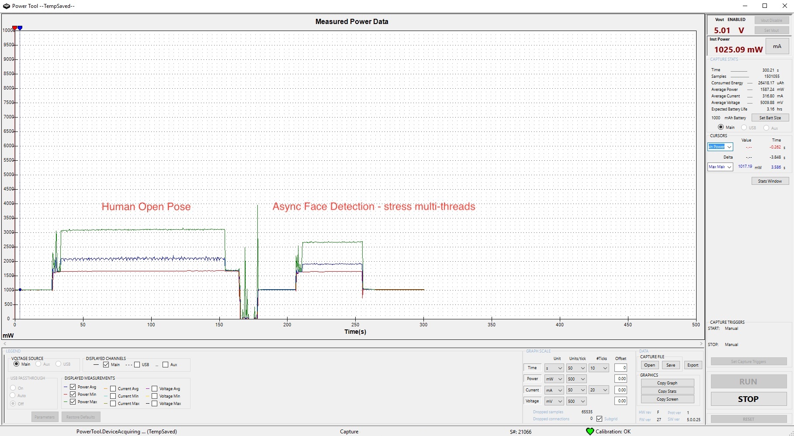
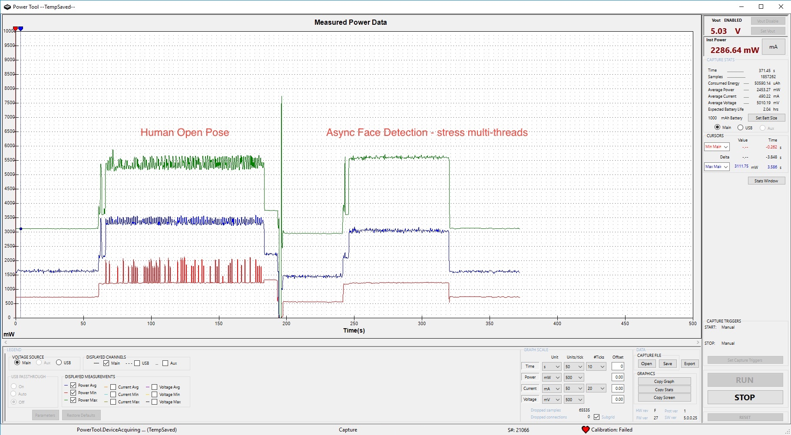

# Platform

## Open Edge Design

- PCB Schematic

## Edge Device

- VMX USB

- VMX PCI

## Power Consumption

- Setup
    - Human Open Pose & Async Face Detection
    - Power measurement w/ HV Power Monitor

- VMX/VM2
    - Human open pose on VMX: ~3w
    - Async face detection on VMX: ~2.6w
    

    - Human open pose on VM2: 5.2w ~ 5.7w
    - Async face detection on VM2: ~5.6w
    

As shown above for the real-time Max(green) Ave(blue) Min(red) measurement of the power comsumption, VMX shows better results than its previous generation of silicon chip.
